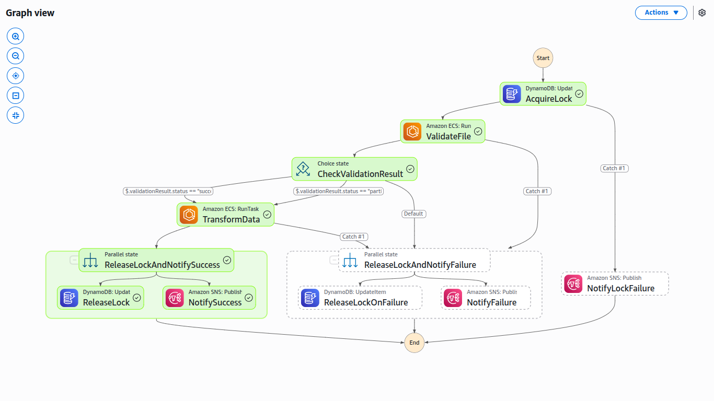

# E-commerce Data Processing Pipeline
## Executive Summary & Quick Start

### System Overview
An event-driven, serverless AWS data processing pipeline that validates, transforms, and analyzes e-commerce data with built-in concurrency control and automated workflows.

### Key Capabilities
- **Automated Processing**: Triggers on S3 file uploads
- **Concurrent Execution Control**: DynamoDB-based locking mechanism
- **Scalable Processing**: Apache Spark + ECS Fargate
- **Real-time Analytics**: Category and order-level KPIs
- **Automated Archival**: S3-based data lifecycle management

### Technology Stack
| Component | Technology | Purpose |
|-----------|------------|---------|
| Orchestration | AWS Step Functions | Workflow coordination |
| Processing | ECS Fargate + Apache Spark | Data transformation |
| Storage | DynamoDB + S3 | Metrics & file storage |
| Monitoring | CloudWatch + SNS | Logging & notifications |
| CI/CD | GitHub Actions | Automated deployment |

---

## Architecture & Data Flow

### High-Level Architecture


### Concurrent Processing Flow

#### Phase 1: File Detection & Aggregation
```
S3 Events (Parallel) -> Lambda Aggregator -> Completeness Check
├── orders/*.csv
├── order_items/*.csv
└── products.csv
```

#### Phase 2: Workflow Orchestration
```
Step Functions Execution
├── Acquire Lock (Atomic)
├── Validate Files (Parallel Schema Check)
├── Transform Data (Spark Processing)
├── Store Results (Batch Write)
└── Release Lock & Notify
```


#### Phase 3: Data Processing (Concurrent)
```
Validation Task               Transformation Task
├── Schema Validation       ├── Data Loading
├── File Quarantine         ├── KPI Calculation
└── Result Generation       └── DynamoDB Storage
```

---

## Core Components

### 1. Concurrency Control System

**Lock Management**
- **Table**: `ProcessingLockTable`
- **Mechanism**: Atomic conditional updates
- **Strategy**: Single-writer, multiple-reader pattern

```json
{
  "LockId": "ecommerce-pipeline-lock",
  "currentlockcount": 0,
  "execution_metadata": {
    "execution_id": "timestamp"
  }
}
```

**Lock Acquisition Flow**
1. Check current lock count
2. Conditional increment if available
3. Store execution metadata
4. Process data
5. Release lock atomically

### 2. File Processing Pipeline

**Input Requirements**
| File Type | Location | Schema | Example |
|-----------|----------|---------|---------|
| Orders | `orders/` | `order_id, user_id, order_date, total_amount, status` | `1, 1001, 2025-07-07, 150.00, completed` |
| Order Items | `order_items/` | `order_id, product_id, quantity, unit_price` | `1, 2001, 2, 75.00` |
| Products | `products/` | `product_id, category, name, price` | `2001, Electronics, Smartphone, 150.00` |

**Processing States**
- **Incoming**: Raw uploaded files
- **Processing**: Files under validation/transformation
- **Quarantine**: Invalid files
- **Archive**: Successfully processed files

### 3. Analytics Engine

**Category-Level KPIs** (`CategoryKPIs` Table)
```json
{
  "category": "Electronics",
  "order_date": "2025-07-07",
  "daily_revenue": 15000.00,
  "avg_order_value": 125.50,
  "avg_return_rate": 0.05
}
```

**Order-Level KPIs** (`OrderKPIs` Table)
```json
{
  "order_date": "2025-07-07",
  "total_orders": 150,
  "total_revenue": 18750.00,
  "total_items_sold": 300,
  "return_rate": 0.03,
  "unique_customers": 120
}
```

### 4. Container Architecture

**Validation Container**
- **Purpose**: Schema validation and quarantine
- **Runtime**: Python + pandas
- **Output**: Validation metadata for next stage

**Transformation Container**
- **Purpose**: Data processing and analytics
- **Runtime**: Apache Spark
- **Output**: Computed KPIs to DynamoDB

---

## Configuration & Deployment

### Environment Setup

#### Prerequisites Checklist
- [ ] AWS Account with appropriate permissions
- [ ] GitHub repository configured
- [ ] Docker installed locally
- [ ] AWS CLI configured

#### Infrastructure Setup (Parallel Execution)

**S3 Buckets**
```bash
# Data bucket
aws s3 mb s3://ecommerce-data-bucket --region us-east-1

# Archive bucket
aws s3 mb s3://ecommerce-archive-bucket --region us-east-1
```

**ECR Repositories**
```bash
# Validation container
aws ecr create-repository --repository-name validation/ecr --region us-east-1

# Transformation container
aws ecr create-repository --repository-name transformation/ecr --region us-east-1
```

**DynamoDB Tables**
```bash
# Lock table
aws dynamodb create-table \
  --table-name ProcessingLockTable \
  --attribute-definitions AttributeName=LockId,AttributeType=S \
  --key-schema AttributeName=LockId,KeyType=HASH \
  --billing-mode PAY_PER_REQUEST

# Category metrics table
aws dynamodb create-table \
  --table-name CategoryKPIs \
  --attribute-definitions \
    AttributeName=category,AttributeType=S \
    AttributeName=order_date,AttributeType=S \
  --key-schema \
    AttributeName=category,KeyType=HASH \
    AttributeName=order_date,KeyType=RANGE \
  --billing-mode PAY_PER_REQUEST

# Order metrics table
aws dynamodb create-table \
  --table-name OrderKPIs \
  --attribute-definitions AttributeName=order_date,AttributeType=S \
  --key-schema AttributeName=order_date,KeyType=HASH \
  --billing-mode PAY_PER_REQUEST
```

### GitHub Secrets Configuration

| Secret | Description | Usage |
|--------|-------------|-------|
| `AWS_ACCESS_KEY_ID` | AWS access key | Deployment authentication |
| `AWS_SECRET_ACCESS_KEY` | AWS secret key | Deployment authentication |
| `AWS_ACCOUNT_ID` | AWS account ID | ECR/ECS resource access |

### CI/CD Pipeline

**Automated Deployment Stages**
1. **Test Phase**: Validation and transformation tests
2. **Build Phase**: Container image builds
3. **Deploy Phase**: Step Functions and ECS updates
4. **Notify Phase**: Deployment status alerts

---

## Operation & Monitoring

### Execution Modes

#### Automatic Execution
- **Trigger**: S3 file uploads
- **Condition**: Complete file set detection
- **Concurrency**: Single active execution

#### Manual Execution
```bash
aws stepfunctions start-execution \
  --state-machine-arn arn:aws:states:us-east-1:ACCOUNT:stateMachine:ecsJob \
  --name manual-execution-$(date +%s) \
  --input '{"fileKey": "", "bucket": "ecommerce-data-bucket"}'
```

### Monitoring Dashboard

#### Step Functions Monitoring
- **Execution Status**: Success/failure rates
- **State Duration**: Performance metrics per state
- **Error Analysis**: Failure patterns and causes

#### CloudWatch Logs Structure
```
/aws/ecs/validation-task     # Validation container logs
/aws/ecs/transformation-task # Transformation container logs
/aws/lambda/file-aggregator  # Lambda function logs
```

#### DynamoDB Monitoring
- **Lock Table**: Current lock status
- **Metrics Tables**: Data volume and query patterns
- **Performance**: Read/write capacity utilization

### Troubleshooting Guide

#### Common Issues Matrix

| Issue | Symptoms | Root Cause | Solution |
|-------|----------|------------|----------|
| Lock Acquisition Failure | ConditionalCheckFailedException | Missing/stuck lock | Reset lock table |
| Validation Failures | Files in quarantine | Schema mismatch | Verify file format |
| Transformation Errors | Empty DynamoDB tables | Data processing issues | Check Spark logs |
| Container Failures | ECS task failures | Resource constraints | Increase task resources |

#### Performance Optimization

**Spark Configuration**
- Partition size optimization based on data volume
- Memory allocation tuning for containers
- Instance type selection for ECS tasks

**DynamoDB Optimization**
- Read/write capacity monitoring
- Batch writing for large datasets
- Partition key distribution analysis

---

## Testing & Quality Assurance

### Test Structure
```
tests/
├── unit/
│   ├── test_validation.py      # Schema validation tests
│   └── test_transformation.py  # Data processing tests
├── integration/
│   ├── test_workflow.py        # End-to-end tests
│   └── test_concurrency.py     # Lock mechanism tests
└── performance/
    └── test_load.py            # Load testing
```

### Test Execution
```bash
# Run all tests
python -m pytest tests/ -v

# Run specific test category
python -m pytest tests/unit/ -v
python -m pytest tests/integration/ -v
```

---


## File Structure

```
project-root/
├── .github/
│   └── workflows/
│       ├── ci-cd.yml                    # CI/CD pipeline
│       └── requirements.txt             # Pipeline dependencies
├── tests/
│   ├── test_validation.py               # Validation tests
│   └── test_transformation.py           # Transformation tests
├── validation-image/
│   ├── Dockerfile                       # Validation container
│   └── validation.py                    # Validation script
├── transformation-image/
│   ├── Dockerfile                       # Transformation container
│   └── transformation.py                # Transformation script
├── lambda_function.py                   # File aggregation logic
├── stepfunction.json                    # Step Functions definition
└── requirements-test.txt                # Test dependencies
```
### Resource Allocation

#### ECS Task Resources
| Task Type | CPU | Memory | Storage |
|-----------|-----|---------|---------|
| Validation | 1024 | 2048 MB | 20 GB |
| Transformation | 2048 | 4096 MB | 30 GB |

#### DynamoDB Capacity
| Table | Read Capacity | Write Capacity | Storage |
|-------|---------------|----------------|---------|
| Lock Table | On-demand | On-demand | < 1 GB |
| Category KPIs | On-demand | On-demand | Variable |
| Order KPIs | On-demand | On-demand | Variable |

---

## API Reference & Extensions

### Step Functions API

**Start Execution**
```json
{
  "stateMachineArn": "arn:aws:states:region:account:stateMachine:ecsJob",
  "name": "execution-name",
  "input": "{\"fileKey\": \"\", \"bucket\": \"bucket-name\"}"
}
```

**Execution Status**
```json
{
  "executionArn": "arn:aws:states:region:account:execution:ecsJob:name",
  "status": "SUCCEEDED|FAILED|RUNNING",
  "startDate": "timestamp",
  "stopDate": "timestamp"
}
```

### Extension Points

#### Integration Opportunities
- Connect to BI tools (Tableau, PowerBI)
- Implement API Gateway for metric queries
- Add machine learning model integration

---

## Security & Compliance

### IAM Roles & Permissions
- **ECS Task Role**: S3, DynamoDB, Step Functions access
- **Lambda Execution Role**: S3, Step Functions permissions
- **Step Functions Role**: ECS, DynamoDB, SNS access

### Data Security
- **Encryption**: S3 server-side encryption
- **Access Control**: IAM-based resource access
- **Audit Trail**: CloudWatch logging for all operations

### Compliance Considerations
- **Data Retention**: Automated S3 lifecycle policies
- **Privacy**: PII handling in transformation layer
- **Monitoring**: Real-time alerting for security events